CREATE TABLE books
(
book_id INT PRIMARY KEY,
title VARCHAR(200) NOT NULL,
author_id INT NOT NULL,
genre VARCHAR(50) NOT NULL,
price DECIMAL(10, 2) NOT NULL
);

CREATE TABLE authors
(
author_id INT PRIMARY KEY,
name VARCHAR(100) NOT NULL,
country VARCHAR(50) NOT NULL,
birth_year INT NOT NULL
);

CREATE TABLE sales
(
sale_id INT PRIMARY KEY,
book_id INT NOT NULL,
sale_date DATE NOT NULL,
quantity INT NOT NULL,
total_amount DECIMAL(10, 2) NOT NULL,
FOREIGN KEY (book_id) REFERENCES books(book_id)
);

INSERT INTO authors
(author_id, name, country, birth_year)
VALUES
(1, 'George Orwell', 'UK', 1903),
(2, 'J.K. Rowling', 'UK', 1965),
(3, 'Mark Twain', 'USA', 1835),
(4, 'Jane Austen', 'UK', 1775),
(5, 'Ernest Hemingway', 'USA', 1899);

INSERT INTO books
(book_id, title, author_id, genre, price)
VALUES
(1, '1984', 1, 'Dystopian', 15.99),
(2, 'Harry Potter and the Philosophers Stone', 2, 'Fantasy', 20.00),
(3, 'Adventures of Huckleberry Finn', 3, 'Fiction', 10.00),
(4, 'Pride and Prejudice', 4, 'Romance', 12.00),
(5, 'The Old Man and the Sea', 5, 'Fiction', 8.99);

INSERT INTO sales
(sale_id, book_id, sale_date, quantity, total_amount)
VALUES
(1, 1, '2024-01-15', 3, 47.97),
(2, 2, '2024-02-10', 2, 40.00),
(3, 3, '2024-03-05', 5, 50.00),
(4, 4, '2024-04-20', 1, 12.00),
(5, 5, '2024-05-25', 4, 35.96);

Task
-1:

Write a query to display authors who have written books in multiple genres and group the results by author name.

select name, genre
from authors a
inner join books b on a.author_id=b.author_id
group by name,genre
having count(genre)>1

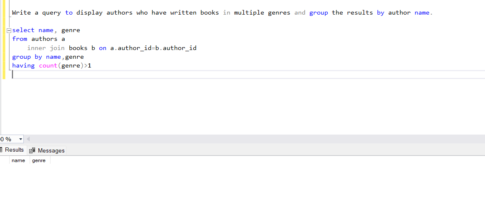

Task-2
Write a query to find the books that have the highest sale total for each genre and group the results by genre.

with
hi_cte
as
(
select title, genre
, rank()
over
(partition by genre order by total_amount desc) as rank
from books b
inner join sales s on b.book_id=s.book_id
)
select \*
from hi_cte
where rank=1

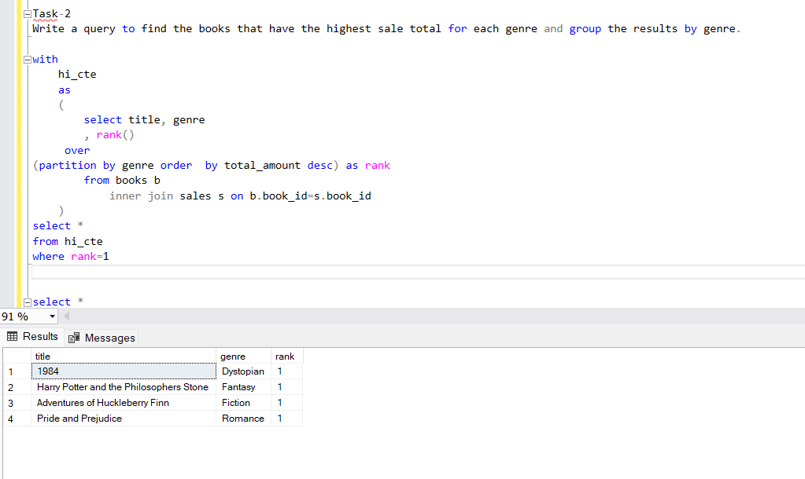

Task-3

Write a query to find the average price of books
for
each
author
and group the results by author name,
only including authors whose average book price is higher than the overall average book price.

with
inavg
AS
(
select name , avg(price) as aver
from authors a
inner join books b on a.author_id=b.author_id
GROUP by name
)
select name
from inavg
where aver>(select avg(price)
from books)

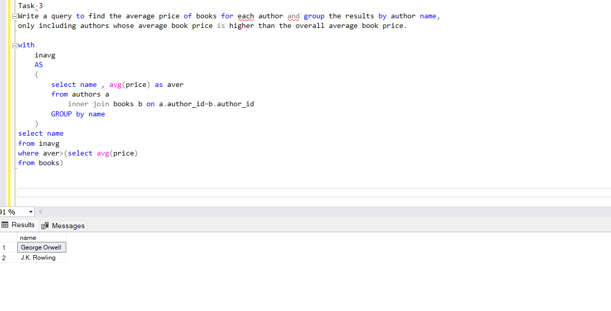

Task-4

--Write a query to find authors who have sold more books than the average number of books
--sold per author and group the results by country.

SELECT name, country, SUM(quantity) as quant
FROM authors a
JOIN books b ON a.author_id = b.author_id
JOIN sales s ON b.book_id = s.book_id
GROUP BY country,name
HAVING SUM(quantity) > (select SUM(quantity)
FROM sales)
ORDER BY SUM(quantity) DESC
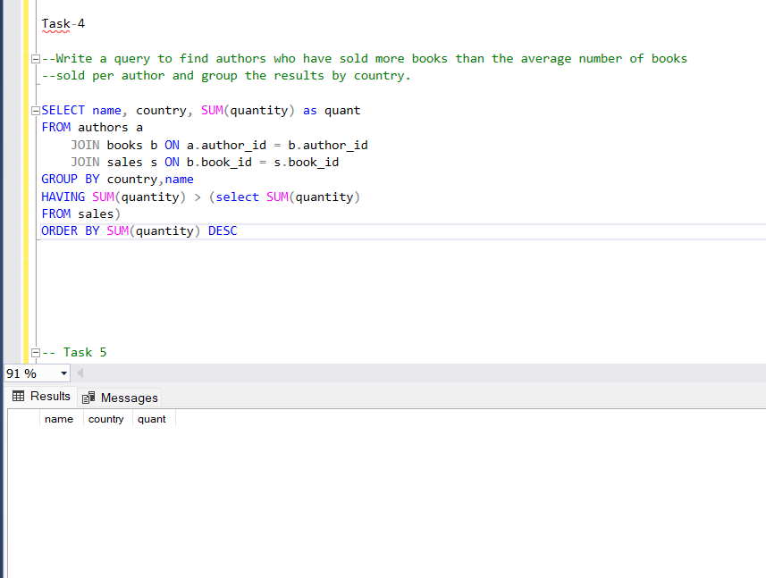

-- Task 5
-- Write a query to find the top 2 highest-priced books and
-- the total quantity sold for each, grouped by book title.

SELECT top(2)
b.title, b.price, SUM(s.quantity) AS total_quantity
FROM books b
JOIN sales s ON b.book_id = s.book_id
GROUP BY b.title,b.price
ORDER BY b.price DESC
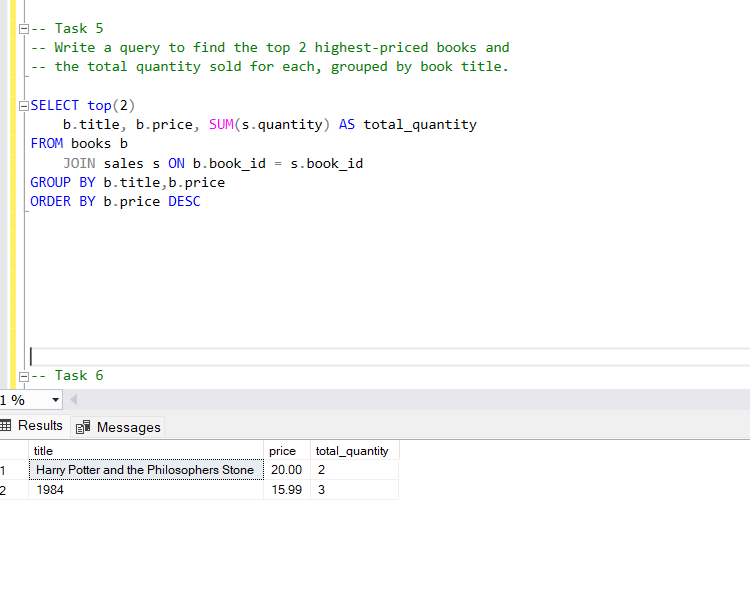

-- Task 6
-- Write a query to display authors whose birth year is earlier than the average
-- birth year of authors from their country and rank them within their country.

WITH
author_country_avg
AS
(
SELECT a.name, a.country, a.birth_year, AVG(a.birth_year) OVER (PARTITION BY a.country) AS country_avg_birth_year
FROM authors a
)
SELECT name, country, DENSE_RANK() OVER (PARTITION BY country ORDER BY birth_year) AS rank
FROM author_country_avg
WHERE birth_year < country_avg_birth_year;
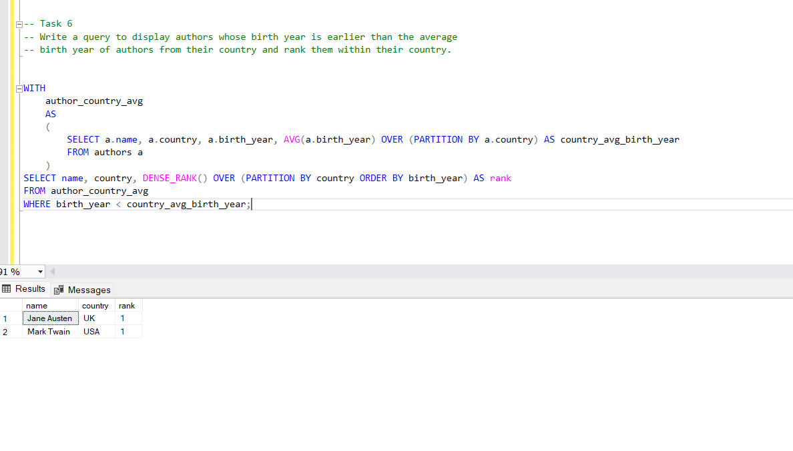

-- Task 7
-- Write a query to find the authors who have written books in
-- both 'Fiction' and 'Romance' genres and group the results by author name.

SELECT a.name
FROM authors a
JOIN books b ON a.author_id = b.author_id
WHERE b.genre IN ('Fiction', 'Romance')
GROUP BY a.name
HAVING COUNT(DISTINCT b.genre) = 2;

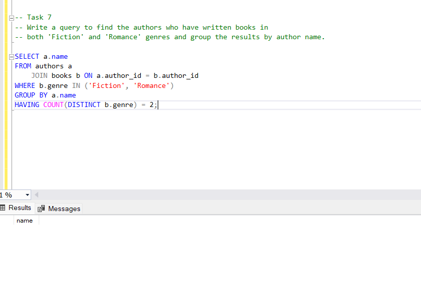
-- Task 8
-- Write a query to find authors who have never written a book
-- in the 'Fantasy' genre and group the results by country.

SELECT a.name, a.country
FROM authors a
LEFT JOIN books b ON a.author_id = b.author_id
WHERE b.genre <> 'Fantasy'
GROUP BY a.name, a.country
HAVING COUNT(b.book_id) = (SELECT COUNT(\*)
FROM books
WHERE genre <> 'Fantasy');

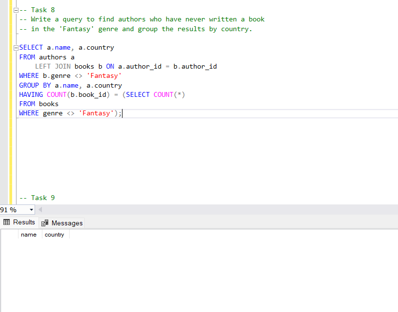
-- Task 9
Write a query to find the books that have been sold in both January and February 2024 and group the results by book title.

SELECT b.title
FROM books b
JOIN sales s ON b.book_id = s.book_id
WHERE s.sale_date BETWEEN '2024-01-01' AND '2024-02-29'
GROUP BY b.title
HAVING COUNT(DISTINCT s.sale_date) = 2;
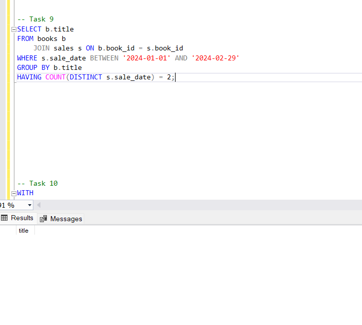
-- Task 10
Write a query to display the authors whose average book price is higher than every book price in the 'Fiction' genre and group the results by author name.
WITH
fiction_prices
AS
(
SELECT price
FROM books
WHERE genre = 'Fiction'
),
author_avg_price
AS
(
SELECT a.name, AVG(b.price) AS avg_price
FROM authors a
JOIN books b ON a.author_id = b.author_id
GROUP BY a.name
)
SELECT name
FROM author_avg_price
WHERE avg_price > (SELECT MAX(price)
FROM fiction_prices)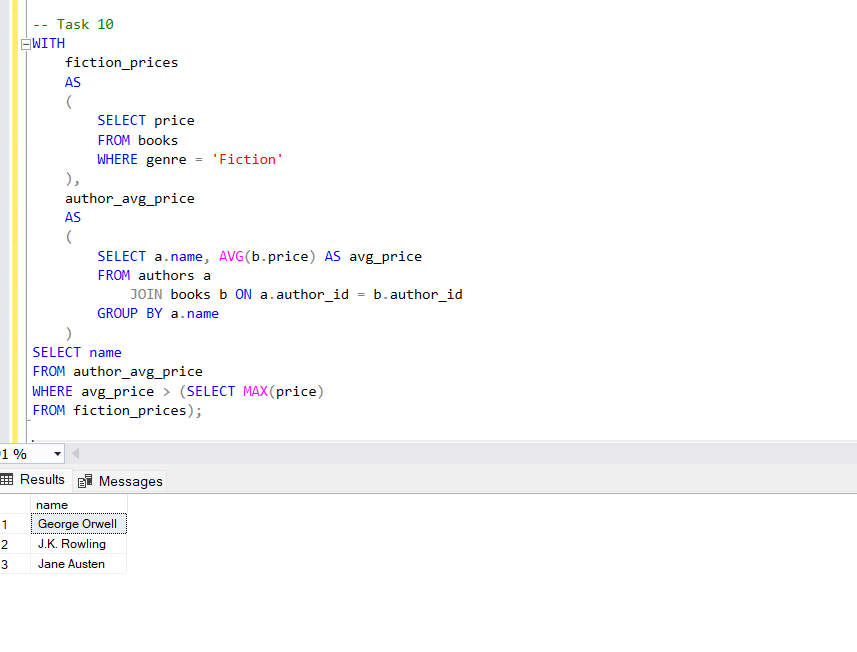;

## Section-2:

-- Task 1
GO
CREATE PROCEDURE GetTotalSalesByAuthor
@AuthorName VARCHAR(100)
AS
BEGIN
SELECT a.name, SUM(s.total_amount) AS TotalSales
FROM authors a
JOIN books b ON a.author_id = b.author_id
JOIN sales s ON b.book_id = s.book_id
WHERE a.name = @AuthorName
GROUP BY a.name;
END;

EXEC GetTotalSalesByAuthor 'J.K. Rowling';
GO

-- Task 2
GO
CREATE FUNCTION GetTotalQuantitySold
(@BookTitle VARCHAR(200))
RETURNS INT
AS
BEGIN
DECLARE @TotalQuantity INT;
SELECT @TotalQuantity = SUM(s.quantity)
FROM books b
JOIN sales s ON b.book_id = s.book_id
WHERE b.title = @BookTitle;
RETURN @TotalQuantity;
END;
Go
SELECT dbo.GetTotalQuantitySold('1984');
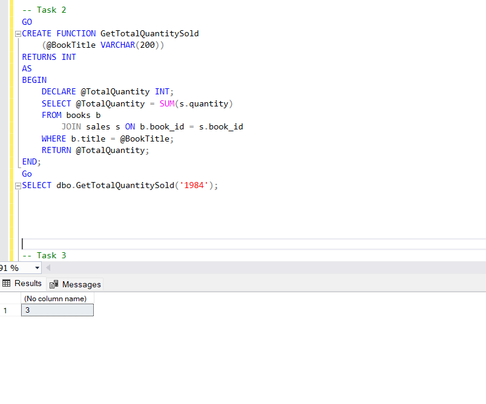
-- Task 3
GO
CREATE VIEW BestSellingBooks
AS
SELECT b.title, SUM(s.total_amount) AS TotalSales
FROM books b
JOIN sales s ON b.book_id = s.book_id
GROUP BY b.title
HAVING SUM(s.total_amount) > 30;
GO
SELECT \*
FROM BestSellingBooks;
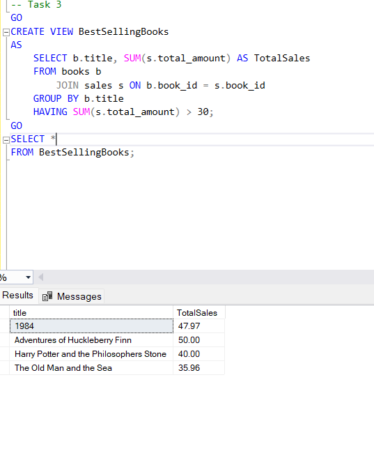

-- Task 4

GO
CREATE PROCEDURE GetAverageBookPriceByAuthor
@AuthorName VARCHAR(100)
AS
BEGIN
SELECT a.name, AVG(b.price) AS AvgBookPrice
FROM authors a
JOIN books b ON a.author_id = b.author_id
WHERE a.name = @AuthorName
GROUP BY a.name;
END;
GO
EXEC GetAverageBookPriceByAuthor 'Mark Twain';
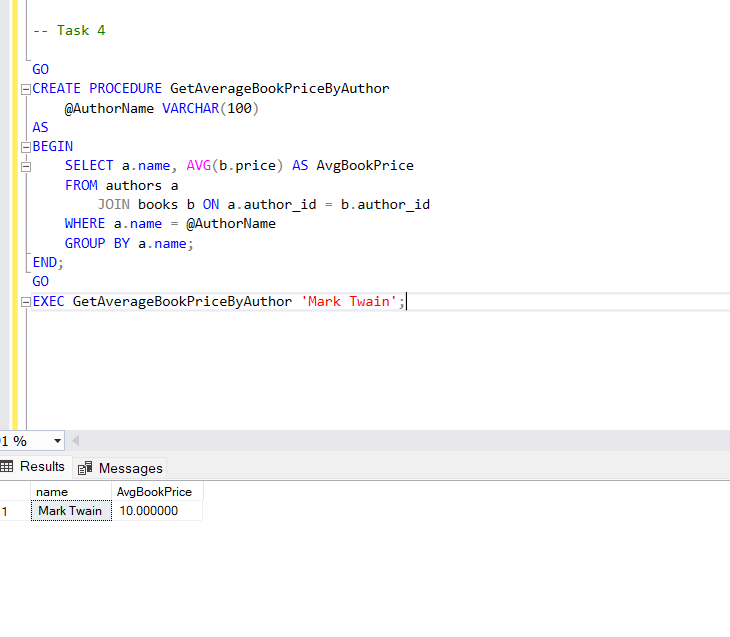

-- Task 5

GO
CREATE FUNCTION GetTotalSalesInMonth
(@Month INT, @Year INT)
RETURNS DECIMAL(10,2)
AS
BEGIN
DECLARE @TotalSales DECIMAL(10,2);
SELECT @TotalSales = SUM(s.total_amount)
FROM sales s
WHERE MONTH(s.sale_date) = @Month AND YEAR(s.sale_date) = @Year;
RETURN @TotalSales;
END;
GO
SELECT dbo.GetTotalSalesInMonth(1, 2024);

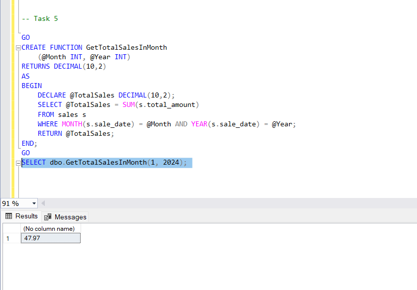
-- Task 6

-- Not Done

GO
CREATE VIEW AuthorsWithMultipleGenres
AS
SELECT a.name, GROUP_CONCAT(DISTINCT b.genre) AS Genres
FROM authors a
JOIN books b ON a.author_id = b.author_id
GROUP BY a.name
HAVING COUNT(DISTINCT b.genre) > 1;
GO
SELECT \*
FROM AuthorsWithMultipleGenres;

-- Task 7
GO
SELECT top 3
a.name, SUM(s.total_amount) AS TotalSales,
RANK() OVER (ORDER BY SUM(s.total_amount) DESC) AS Rank
FROM authors a
JOIN books b ON a.author_id = b.author_id
JOIN sales s ON b.book_id = s.book_id
GROUP BY a.name
ORDER BY Rank
GO
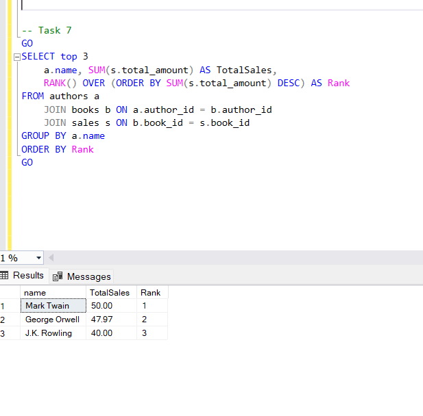

-- Task 8
CREATE PROCEDURE GetTopSellingBookInGenre
@Genre VARCHAR(50)
AS
BEGIN
SELECT TOP 1
b.title, SUM(s.total_amount) AS TotalSales
FROM books b
JOIN sales s ON b.book_id = s.book_id
WHERE b.genre = @Genre
GROUP BY b.title
ORDER BY TotalSales DESC;
END;

EXEC GetTopSellingBookInGenre 'Fantasy';
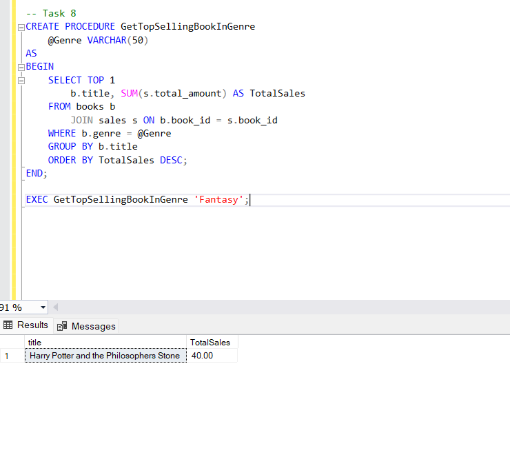

-- Task 9
GO
CREATE FUNCTION GetAverageSalesPerGenre
(@Genre VARCHAR(50))
RETURNS DECIMAL(10,2)
AS
BEGIN
DECLARE @AverageSales DECIMAL(10,2);
SELECT @AverageSales = AVG(TotalSales)
FROM (
SELECT b.genre, SUM(s.total_amount) AS TotalSales
FROM books b
JOIN sales s ON b.book_id = s.book_id
WHERE b.genre = @Genre
GROUP BY b.genre
) AS GenreSales;
RETURN @AverageSales;
END;
GO
SELECT dbo.GetAverageSalesPerGenre('Romance');
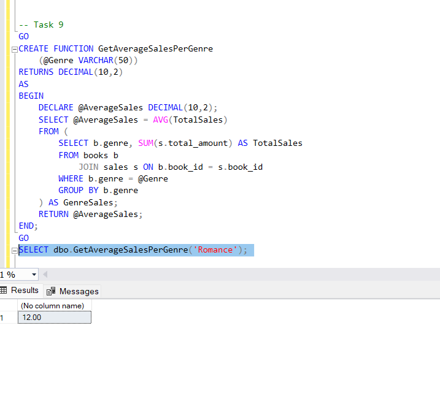

-- Section 3

-- Task 1
GO
CREATE PROCEDURE AddNewBookAndUpdateAuthorAverage
@Title VARCHAR(200),
@AuthorID INT,
@Genre VARCHAR(50),
@Price DECIMAL(10,2)
AS
BEGIN
BEGIN TRANSACTION

    INSERT INTO books
        (title, author_id, genre, price)
    VALUES
        (@Title, @AuthorID, @Genre, @Price)

    DECLARE @NewAvgPrice DECIMAL(10,2)
    SELECT @NewAvgPrice = AVG(price)
    FROM books
    WHERE author_id = @AuthorID

    COMMIT TRANSACTION

    RETURN @NewAvgPrice

END
GO
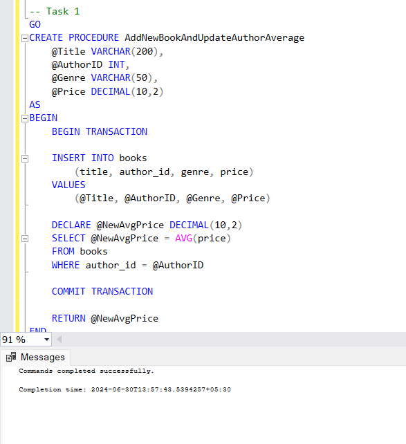
-- Task 2
GO
CREATE PROCEDURE DeleteBookAndUpdateAuthorSales
@BookID INT
AS
BEGIN
BEGIN TRANSACTION

    DECLARE @AuthorID INT, @TotalSales DECIMAL(10,2)
    SELECT @AuthorID = author_id, @TotalSales = SUM(s.total_amount)
    FROM books b
        LEFT JOIN sales s ON b.book_id = s.book_id
    WHERE b.book_id = @BookID
    GROUP BY b.author_id

    DELETE FROM sales WHERE book_id = @BookID
    DELETE FROM books WHERE book_id = @BookID

    COMMIT TRANSACTION

    RETURN @TotalSales

END
GO
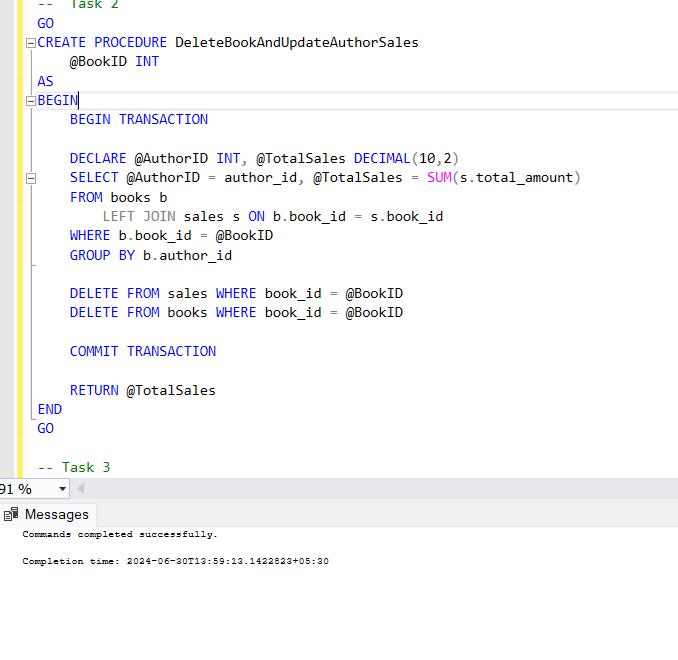

-- Task 3
GO
CREATE PROCEDURE TransferBookSales
@SourceBookID INT,
@TargetBookID INT
AS
BEGIN
BEGIN TRANSACTION

    DECLARE @SourceBookExists INT, @TargetBookExists INT
    SELECT @SourceBookExists = CASE WHEN COUNT(*) > 0 THEN 1 ELSE 0 END
    FROM books
    WHERE book_id = @SourceBookID
    SELECT @TargetBookExists = CASE WHEN COUNT(*) > 0 THEN 1 ELSE 0 END
    FROM books
    WHERE book_id = @TargetBookID

    UPDATE sales
    SET book_id = @TargetBookID
    WHERE book_id = @SourceBookID

    DECLARE @SourceTotalSales DECIMAL(10,2), @TargetTotalSales DECIMAL(10,2)
    SELECT @SourceTotalSales = SUM(total_amount)
    FROM sales
    WHERE book_id = @SourceBookID
    SELECT @TargetTotalSales = SUM(total_amount)
    FROM sales
    WHERE book_id = @TargetBookID

    COMMIT TRANSACTION

    RETURN @SourceTotalSales + @TargetTotalSales

END
GO
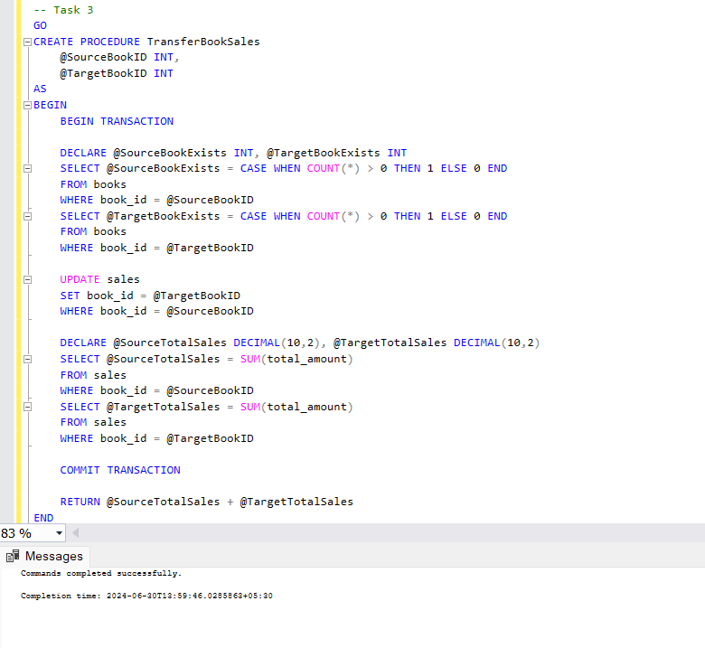

-- Task 4
GO
CREATE PROCEDURE AddSaleAndUpdateBookQuantity
@BookID INT,
@Quantity INT,
@TotalAmount DECIMAL(10,2)
AS
BEGIN
BEGIN TRANSACTION

    INSERT INTO sales
        (book_id, sale_date, quantity, total_amount)
    VALUES
        (@BookID, GETDATE(), @Quantity, @TotalAmount)

    DECLARE @NewTotalQuantity INT
    SELECT @NewTotalQuantity = SUM(quantity)
    FROM sales
    WHERE book_id = @BookID

    COMMIT TRANSACTION

    RETURN @NewTotalQuantity

END
GO
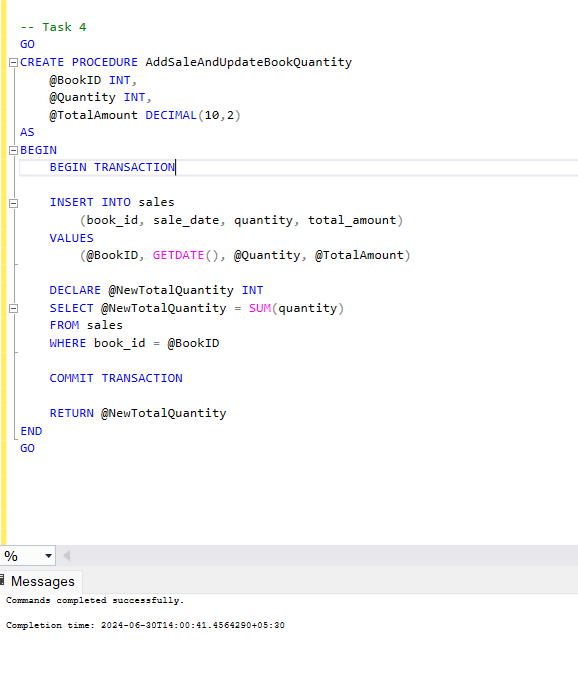
-- Task 5
GO
CREATE PROCEDURE UpdateBookPriceAndRecalculateAuthorAverage
@BookID INT,
@NewPrice DECIMAL(10,2)
AS
BEGIN
BEGIN TRANSACTION

    DECLARE @AuthorID INT
    SELECT @AuthorID = author_id
    FROM books
    WHERE book_id = @BookID

    UPDATE books
    SET price = @NewPrice
    WHERE book_id = @BookID

    DECLARE @NewAvgPrice DECIMAL(10,2)
    SELECT @NewAvgPrice = AVG(price)
    FROM books
    WHERE author_id = @AuthorID

    COMMIT TRANSACTION

    RETURN @NewAvgPrice

END
GO
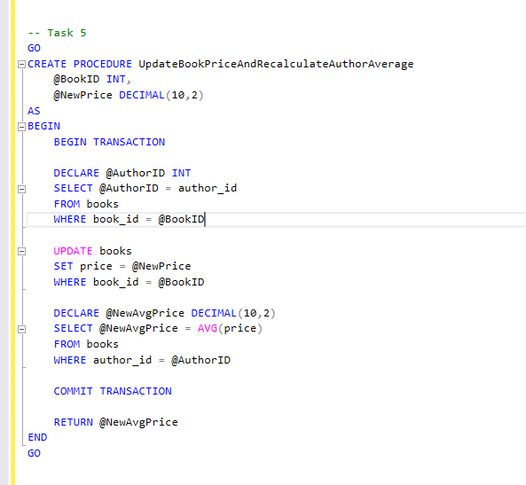
-- Section 4

-- Task 1
GO
CREATE FUNCTION GetTotalSalesByBook()
RETURNS TABLE
AS
RETURN
(
SELECT b.title, SUM(s.total_amount) AS TotalSales
FROM books b
JOIN sales s ON b.book_id = s.book_id
GROUP BY b.title
);
GO
SELECT \*
FROM GetTotalSalesByBook();
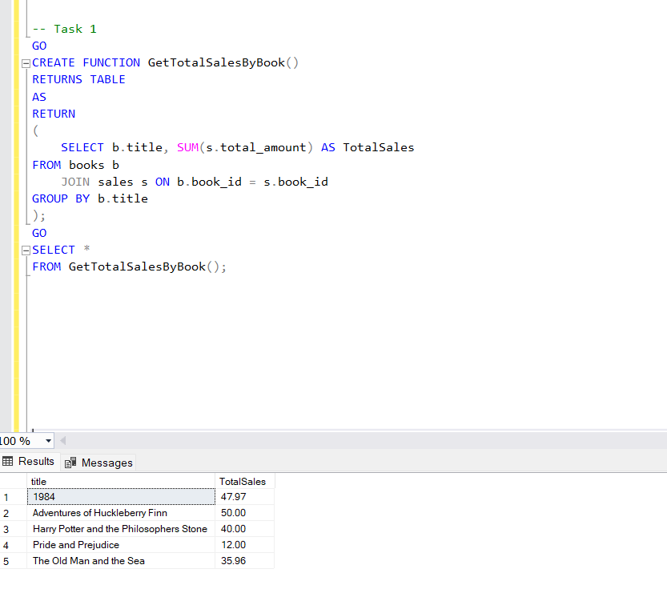

-- Task 2
GO
CREATE FUNCTION GetTotalSalesByGenre()
RETURNS @GenreSales TABLE
(
Genre VARCHAR(50),
TotalQuantity INT
)
AS
BEGIN
INSERT INTO @GenreSales
SELECT b.genre, SUM(s.quantity) AS TotalQuantity
FROM books b
JOIN sales s ON b.book_id = s.book_id
GROUP BY b.genre
RETURN
END;
GO

SELECT \*
FROM GetTotalSalesByGenre();
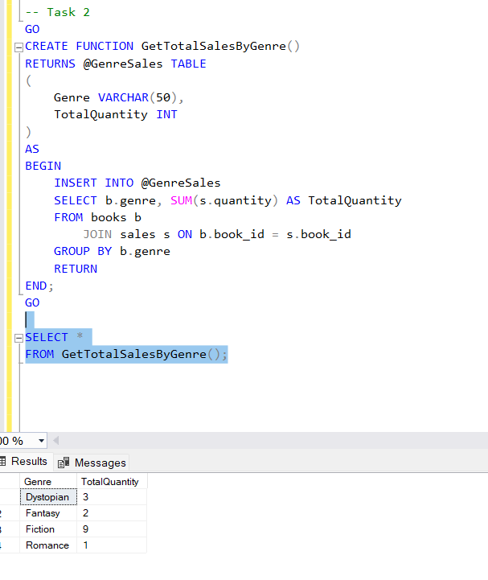
-- Task 3
GO
CREATE FUNCTION GetAverageBookPriceByAuthorName
(
@AuthorName VARCHAR(100)
)
RETURNS DECIMAL(10,2)
AS
BEGIN
DECLARE @AvgPrice DECIMAL(10,2)
SELECT @AvgPrice = AVG(b.price)
FROM authors a
JOIN books b ON a.author_id = b.author_id
WHERE a.name = @AuthorName
RETURN @AvgPrice
END;
GO
SELECT dbo.GetAverageBookPriceByAuthorName('Jane Austen');
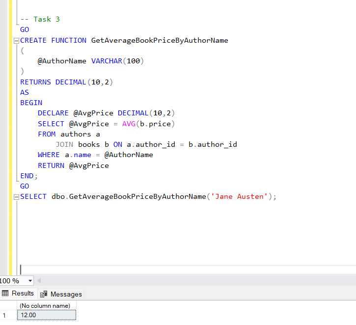
-- Task 4
GO
CREATE PROCEDURE GetBooksWithMinimumSales
@MinSales DECIMAL(10,2)
AS
BEGIN
SELECT b.title, SUM(s.total_amount) AS TotalSales
FROM books b
JOIN sales s ON b.book_id = s.book_id
GROUP BY b.title
HAVING SUM(s.total_amount) > @MinSales
END;
GO
EXEC GetBooksWithMinimumSales 40;
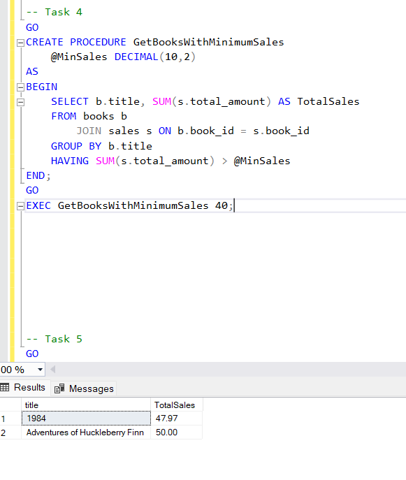
-- Task 5
GO
CREATE INDEX IX_Sales_BookID ON sales (book_id);
GO
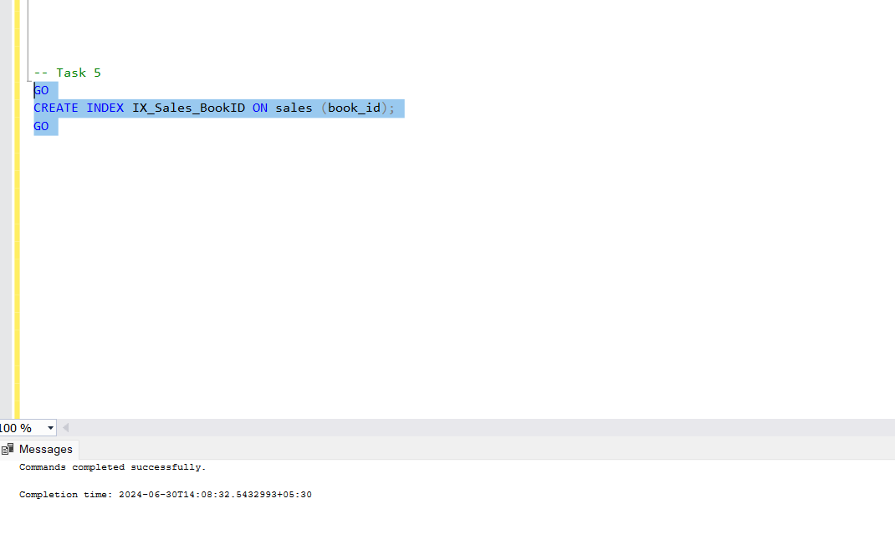
-- Task 6
GO
SELECT
a.name AS [@name],
a.country AS [@country],
a.birth_year AS [@birth_year],
(
SELECT
b.title,
b.genre,
b.price
FROM books b
WHERE a.author_id = b.author_id
FOR XML PATH('book')
)
FROM authors a
FOR XML PATH('author'), ROOT('authors');
GO
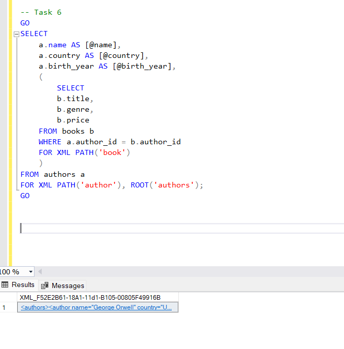
-- Task 7
GO
SELECT
json_query((
SELECT
a.name AS [name],
a.country AS [country],
a.birth_year AS [birth_year],
(
SELECT
b.title,
b.genre,
b.price
FROM books b
WHERE a.author_id = b.author_id
FOR JSON PATH
) AS [books]
FROM authors a
FOR JSON PATH
))
GO
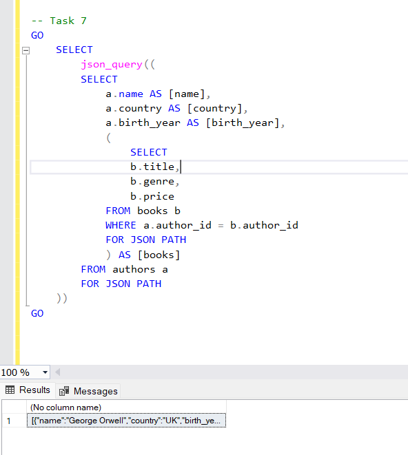
-- Task 8
GO
CREATE FUNCTION GetTotalSalesInYear
(
@Year INT
)
RETURNS DECIMAL(10,2)
AS
BEGIN
DECLARE @TotalSales DECIMAL(10,2)
SELECT @TotalSales = SUM(s.total_amount)
FROM sales s
WHERE YEAR(s.sale_date) = @Year
RETURN @TotalSales
END;
GO

    SELECT dbo.GetTotalSalesInYear(2024);

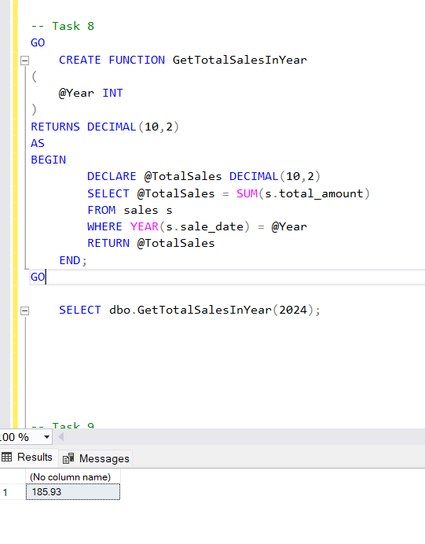

-- Task 9
GO
CREATE PROCEDURE GetGenreSalesReport
@Genre VARCHAR(50)
AS
BEGIN
SELECT
b.genre,
SUM(s.total_amount) AS TotalSales,
AVG(s.total_amount) AS AverageSales
FROM books b
JOIN sales s ON b.book_id = s.book_id
WHERE b.genre = @Genre
GROUP BY b.genre
END;
GO
EXEC GetGenreSalesReport 'Fiction';
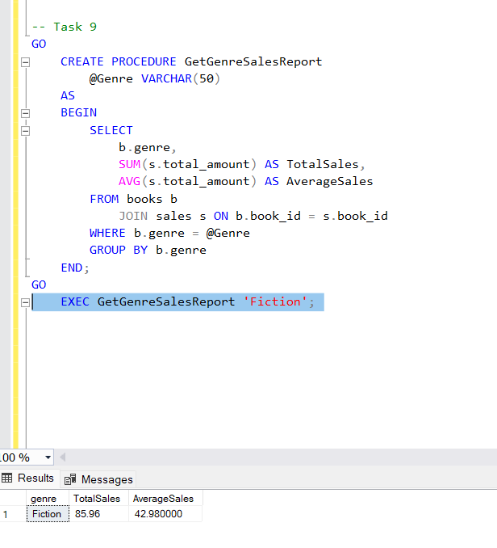
-- Task 10
-- Not Done
GO
WITH
BookRatings
AS
(
SELECT
b.title,
AVG(r.rating) AS AvgRating
FROM books b
JOIN ratings r ON b.book_id = r.book_id
GROUP BY b.title
)
SELECT top 3
title,
AvgRating,
RANK() OVER (ORDER BY AvgRating DESC) AS Rank
FROM BookRatings
ORDER BY Rank
GO

-- Section 5

-- Task 1
GO

    CREATE VIEW BookSalesRunningTotal
    AS
        SELECT
            s.sale_id,
            b.title,
            s.total_amount,
            SUM(s.total_amount) OVER (PARTITION BY b.title ORDER BY s.sale_id) AS RunningTotal
        FROM
            sales s
            JOIN books b ON s.book_id = b.book_id;

GO
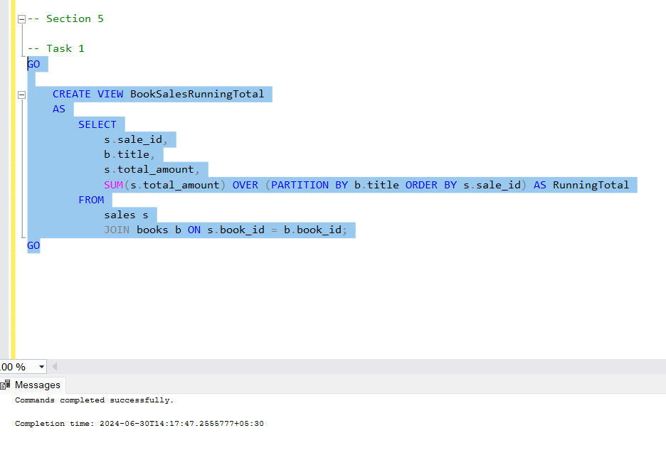
-- Task 2
GO
CREATE VIEW AuthorSalesRunningTotal
AS
SELECT
s.sale_id,
a.name AS AuthorName,
s.quantity,
SUM(s.quantity) OVER (PARTITION BY a.name ORDER BY s.sale_id) AS RunningTotal
FROM
sales s
JOIN books b ON s.book_id = b.book_id
JOIN authors a ON b.author_id = a.author_id;
GO
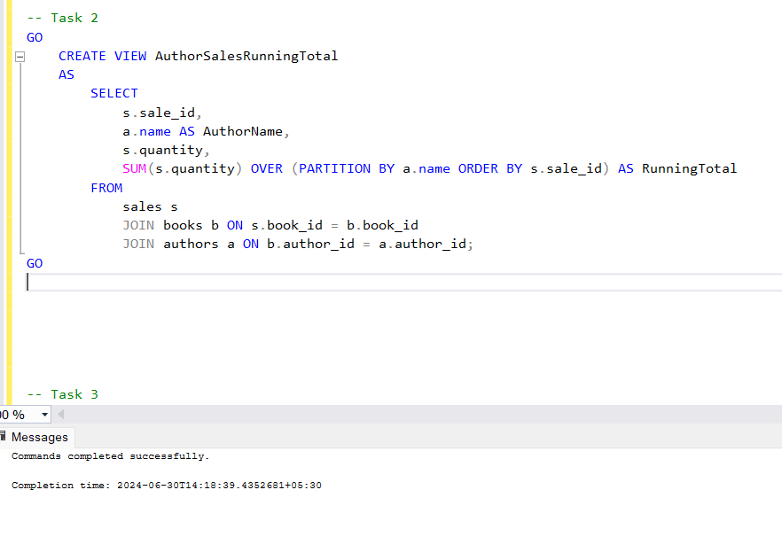
-- Task 3
GO
CREATE VIEW GenreSalesRunningTotalAndAverage
AS
SELECT
s.sale_id,
b.genre,
s.total_amount,
SUM(s.total_amount) OVER (PARTITION BY b.genre ORDER BY s.sale_id) AS RunningTotal,
AVG(s.total_amount) OVER (PARTITION BY b.genre ORDER BY s.sale_id) AS RunningAverage
FROM
sales s
JOIN books b ON s.book_id = b.book_id;
GO
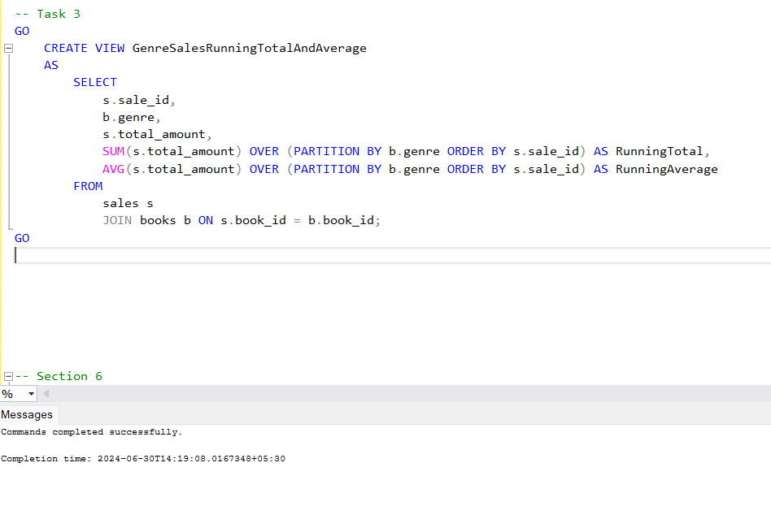
-- Section 6
-- Task 1
GO
CREATE TRIGGER UpdateTotalSalesAfterInsert
ON sales
AFTER INSERT
AS
BEGIN
SET NOCOUNT ON;

        UPDATE b
    SET b.price = b.price + i.total_amount
    FROM books b
            JOIN inserted i ON b.book_id = i.book_id
    END

GO
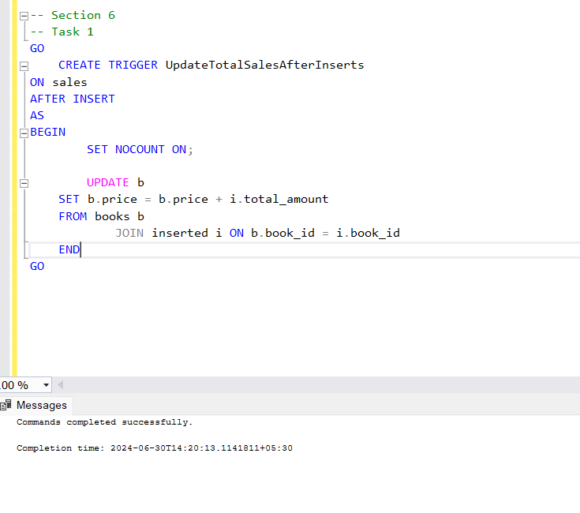
-- Task 2
GO
CREATE TRIGGER LogSalesDelete
ON sales
AFTER DELETE
AS
BEGIN

        CREATE TABLE sales_log
        (
            log_id INT IDENTITY(1,1) PRIMARY KEY,
            sale_id INT,
            book_id INT,
            delete_date DATETIME
        )
        INSERT INTO sales_log
            (sale_id, book_id, delete_date)
        SELECT d.sale_id, d.book_id, GETDATE()
        FROM deleted d
    END

GO
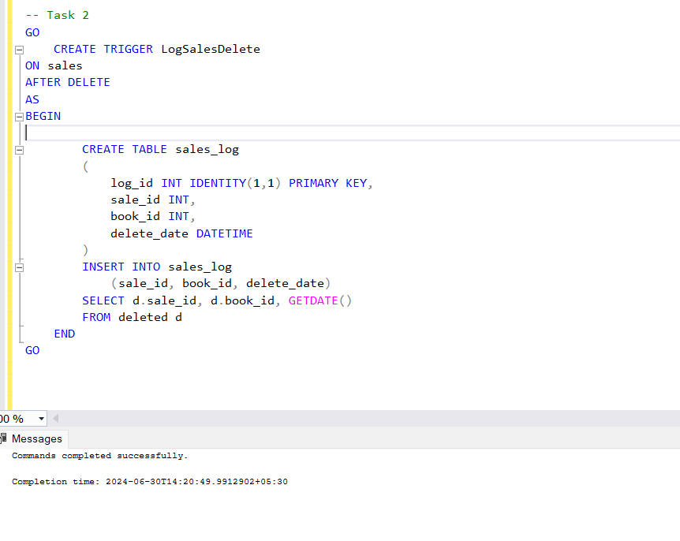

-- Task 3
GO
CREATE TRIGGER PreventNegativeQuantityUpdate
ON sales
INSTEAD OF UPDATE
AS
BEGIN
SET NOCOUNT ON;

        DECLARE @NewQuantity INT
        SELECT @NewQuantity = i.quantity
        FROM inserted i

        UPDATE s
    SET s.quantity = i.quantity,
        s.total_amount = i.quantity * s.total_amount
    FROM sales s
            JOIN inserted i ON s.sale_id = i.sale_id
    END

GO
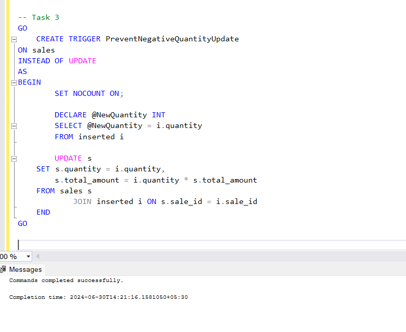
